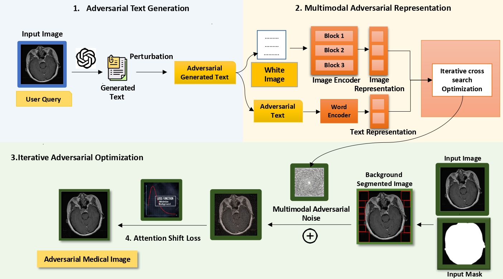

# When-Background-Matters-Breaking-Medical-Vision-Language-Models-by-Transferable-Attack
**[ACL 2026 ORAL]** MedFocusLeak is a transferable black-box multimodal adversarial attack that injects imperceptible perturbations into non-diagnostic background regions and shifts model attention to induce plausible but incorrect medical diagnoses.

<p align="center">
  <a href="https://arxiv.org/abs/2603.24157"></a>
  <a href="https://arxiv.org/pdf/2603.24157"></a>
     
</p>


## Abstract

Vision–Language Models (VLMs) are increasingly used in clinical diagnostics, yet their robustness to adversarial attacks remains largely unexplored, posing significant risks. Existing medical attacks often target secondary goals such as model stealing or adversarial fine-tuning, while transferable attacks from natural images introduce visible distortions that clinicians can easily detect. To address this, we propose MedFocusLeak, a highly transferable black-box multimodal attack that induces incorrect medical diagnoses while keeping perturbations imperceptible. The method injects coordinated perturbations into non-diagnostic background regions and uses an attention-distraction mechanism to shift the model’s focus away from pathological areas. Across six medical imaging modalities, MedFocusLeak achieves state-of-the-art performance, generating plausible yet incorrect diagnostic outputs across diverse VLMs. We also introduce a unified evaluation framework with novel metrics that jointly measure attack success and image fidelity. Overall, our findings reveal a critical weakness in the reasoning capabilities of modern VLMs in clinical settings.


## Contributions

Our contributions can be summarized as:

(i) First **systematic study of transferable adversarial attacks in medical vision–language models** under realistic black-box settings.

(ii) Introduction of **MedFocusLeak**, a multimodal attack that creates semantically aware, visually imperceptible perturbations while preserving diagnostic quality.

(iii) **Extensive experiments across six medical datasets and modalities** showing state-of-the-art performance in inducing clinically plausible misdiagnoses in black-box VLMs.

## Framework



**Framework of MedFocusLeak:** The attack first generates a targeted adversarial text that defines the
malicious diagnostic objective and guides joint image–text optimization to synthesize a multimodal adversarial
signal. The resulting perturbation is confined to non-diagnostic background regions to remain imperceptible while
preserving clinical content. An attention-shift loss then explicitly redirects the model’s visual focus toward these
perturbed regions, causing the model to rely on malicious cues and produce an incorrect diagnosis.


## Threat Framework

### 1. Deployment Setting
- We consider a medical vision–language model (f) that takes a medical image and a clinical prompt as input and generates a diagnostic report.  
- The model is accessed in a **black-box setting** (API-only access), with no visibility into parameters, gradients, or training data, reflecting real-world clinical deployment.

---

### 2. Provider Assumptions
- The provider has full control over model training, preprocessing, and deployment pipelines.  
- The objective is to generate **accurate and clinically reliable diagnoses** for user queries.

---

### 3. Attacker Knowledge
- The attacker knows the task interface (image + text → diagnostic text).  
- Has access to **surrogate models** (e.g., open-source VLMs, CLIP-like encoders) to craft transferable attacks.  
- Operates under **limited or zero query access** to the target model.

---

### 4. Attacker Capabilities
- Can perturb the **input image and/or prompt** to construct adversarial inputs.  
- Must satisfy:
  - **Imperceptibility**: perturbations should not degrade visual quality.  
  - **Clinical consistency**: modality and semantics remain unchanged.  
  - **Realism**: no white-box assumptions; relies on transferability.

---

### 5. Attack Objective
- Generate **plausible but incorrect medical diagnoses**.  
- Specifically:
  - Redirect attention away from **clinically relevant regions**.  
  - Induce reliance on **adversarial background cues**.  
  - Preserve diagnostic realism to avoid detection by clinicians.

---

### 6. Core Threat Insight
- The attack leverages **shared feature representations and attention patterns** across models.  
- Adversarial examples crafted on surrogate models **transfer effectively to unseen black-box VLMs**, making the threat practical in real-world healthcare systems.


## Performance Deepdive


---

## Repository Structure

```
When-Background-Matters-Breaking-Medical-Vision-Language-Models-by-Transferable-Attack/
└── MedFocusLeak/
    ├── DataProcessing/
    │   ├── Adv_Text.py              # Step 1: GPT-4o-mini adversarial text generation
    │   └── White_Img.py             # Step 2: Render adversarial text onto white canvas images
    ├── Modified_mattack/
    │   ├── config/
    │   ├── resources/
    │   │   └── images/
    │   │       ├── bigscale/        # ← Place clean source images here (Step 4 input)
    │   │       ├── target_images/   # ← Copy Step 3 output here (Step 4 target input)
    │   │       └── masks/           # ← Place segmentation masks here (Step 4 input)
    │   ├── surrogates/
    │   ├── blackbox_text_generation.py
    │   ├── config_schema.py
    │   ├── cropping.py
    │   ├── cropping2.py
    │   ├── evaluation_metrics.py
    │   ├── generate_adversarial_samples.py
    │   ├── generate_adversarial_samples2.py  # Step 4: Ensemble FGSM/MI-FGSM/PGD attack
    │   ├── gpt_evaluate.py
    │   ├── keyword_matching_gpt.py
    │   ├── requirements.txt
    │   └── utils.py
    ├── MultimodalFusion/
    │   └── Target_Img_gen.py        # Step 3: CLIP feature alignment (Multi-modal fusion)
    └── attentionshift/
        ├── Imgs/                    # ← Copy Step 4 output images here (Step 5 input)
        ├── masks/                   # ← Segmentation masks
        ├── surrogate/
        ├── Attack2.py               # AttentionPerturber class
        ├── Visualize.py
        ├── Visualize2.py
        ├── run_attack.py
        └── run_attack2.py           # Step 5: Attention-based background perturbation
```

---

## Pipeline Overview

The full attack pipeline runs in **5 sequential steps**. Between certain steps you need to manually copy outputs into the correct repo folders before proceeding.

```
[data.csv]  (columns: 'findings', 'images')
     │
     ▼
 Step 1 ── Adv_Text.py
     │      Edits findings text with k adversarial changes → modified_data.csv
     ▼
 Step 2 ── White_Img.py
     │      Renders modified findings as white JPEG images
     │
     ▼
 Step 3 ── Target_Img_gen.py
     │
     │
     │  ── COPY output images ──────────►  Modified_mattack/resources/images/target_images/
     ▼
 Step 4 ── generate_adversarial_samples2.py   (run from inside Modified_mattack/)
     │      Ensemble FGSM/MI-FGSM/PGD with background cropping
     │      Reads:  resources/images/bigscale/      (source)
     │              resources/images/target_images/ (targets)
     │              resources/images/masks/         (masks)
     │      Writes: Modified_mattack/img_output/
     │
     │  ── COPY img_output images ──────►  attentionshift/Imgs/
     ▼
 Step 5 ── run_attack2.py   (run from inside attentionshift/)
            Attention-shift PGD across BLIP/CLIP ensemble
            Reads:  attentionshift/Imgs/    (images)
                    attentionshift/masks/   (masks)
            Writes: attentionshift/results/
```

---

## Quick Start

### Prerequisites

- Python 3.8+
- CUDA-capable GPU (strongly recommended; Steps 3–5 will be very slow on CPU)
- API keys for:
  - **OpenAI** — for Step 1 (`Adv_Text.py`)
  - **HuggingFace** — for downloading CLIP/BLIP surrogate models in Steps 3–5

### Installation

1. Clone the repository:

```bash
git clone <repository-url>
cd When-Background-Matters-Breaking-Medical-Vision-Language-Models-by-Transferable-Attack
```

2. Install dependencies:

```bash
pip install -r requirements.txt
```

### Prepare Input Folders

Before running, place your data in the following locations:

```bash
# Clean source medical images (ImageFolder format — one subfolder per class)
MedFocusLeak/Modified_mattack/resources/images/bigscale/<class>/image.jpg

# Segmentation masks matching the source images (same ImageFolder structure)
MedFocusLeak/Modified_mattack/resources/images/masks/<class>/mask.png
MedFocusLeak/attentionshift/masks/<class>/mask.png

# Input CSV with at minimum two columns: 'findings' and 'images'
data.csv
```

---

## Step-by-Step Usage

### Step 1 — Generate Adversarial Text (`Adv_Text.py`)

Uses GPT-4o-mini to make `k` medically significant but minimal word-level edits to radiology findings (e.g., swapping laterality, severity grades, anatomical locations).

Edit the bottom of `Adv_Text.py` to call `process_csv`:

```python
process_csv(
    input_csv="path/to/data.csv",
    output_csv="path/to/modified_data.csv",
    k=5   # number of adversarial edits per report
)
```

```bash
export OPENAI_API_KEY="your-api-key-here"
python MedFocusLeak/DataProcessing/Adv_Text.py
```

**Output:** `modified_data.csv` — original CSV with a new `Findings_5` column (or `Findings_k` for other values of `k`).

---

### Step 2 — Render Text as White Canvas Images (`White_Img.py`)

Renders each adversarially modified finding from Step 1 onto a white JPEG canvas. These images serve as the **target images** for the feature-alignment attack in Step 4.

```bash
python MedFocusLeak/DataProcessing/White_Img.py \
    --csv     path/to/modified_data.csv \
    --out_dir path/to/white_images_output \
    --limit   500
```

| Argument    | Description                                   | Default |
|-------------|-----------------------------------------------|---------|
| `--csv`     | Path to CSV produced by Step 1                | —       |
| `--out_dir` | Directory to save rendered JPEG images        | —       |
| `--limit`   | Maximum number of rows to process             | `100`   |

**Output:** JPEG images, one per CSV row, saved to `--out_dir`.

---

### Step 3 — Multimodal fusion Target Image Generation (`Target_Img_gen.py`)

Runs a PGD attack using Block-wise Similarity Attack (BSA) loss across all CLIP encoder layers to align adversarial source images towards the white text targets from Step 2.

```bash
python MedFocusLeak/MultimodalFusion/Target_Img_gen.py \
    --csv_path    path/to/modified_data.csv \
    --image_col   images \
    --text_col    Findings_5 \
    --output_dir  path/to/bsa_output \
    --model_name  openai/clip-vit-base-patch32 \
    --eps         0.0627 \
    --alpha       0.00392 \
    --steps       100 \
    --save_perturbation
```

| Argument              | Description                                     | Default                        |
|-----------------------|-------------------------------------------------|--------------------------------|
| `--csv_path`          | Path to CSV with image paths and findings text  | —                              |
| `--image_col`         | Column name containing source image paths       | —                              |
| `--text_col`          | Column name containing findings text            | —                              |
| `--output_dir`        | Directory to save adversarial images            | —                              |
| `--model_name`        | HuggingFace CLIP model identifier               | `openai/clip-vit-base-patch32` |
| `--eps`               | L∞ budget (16/255 ≈ 0.0627)                    | `0.0627`                       |
| `--alpha`             | PGD step size (1/255 ≈ 0.00392)                | `0.00392`                      |
| `--steps`             | Number of PGD iterations                        | `100`                          |
| `--save_perturbation` | Also save the perturbation delta as an image    | `False`                        |

**Output:** Adversarial images saved to `--output_dir`.

>  **After this step — manual copy required:**
> ```bash
> cp path/to/white_images_output/* \
>    MedFocusLeak/Modified_mattack/resources/images/target_images/
> ```

---

### Step 4 — Ensemble Adversarial Attack (`generate_adversarial_samples2.py`)

Runs FGSM, MI-FGSM, or PGD attacks using an ensemble of CLIP surrogate models with optional background-region cropping via `CustomBackgroundCrop`. All paths are already configured correctly in `config_schema.py` — no changes needed if you copied files to the right locations.

**Default paths in `config_schema.py`:**

```python
cle_data_path  = "resources/images/bigscale"       # source images (Clean Images)
tgt_data_path  = "resources/images/target_images"  # target images (from Step 3 copy)
mask_data_path = "resources/images/masks"          # segmentation masks (Mask of those Clean Images)
output         = "./img_output"
```

To change the attack type or hyperparameters, edit `config_schema.py`:

```python
attack          = "fgsm"   # one of: "fgsm", "mifgsm", "pgd"
optim.steps     = 300
optim.epsilon   = 4        # in pixel units
optim.alpha     = 1.0

model.backbone  = ["L336", "B16", "B32", "Laion"]
model.ensemble  = True
model.device    = "cuda:0"
model.input_res = 336
model.use_source_crop = True   # restrict perturbation to background regions only
```

**Available backbone keys:**

| Key     | Model                                     |
|---------|-------------------------------------------|
| `L336`  | `openai/clip-vit-large-patch14-336`       |
| `B16`   | `openai/clip-vit-base-patch16`            |
| `B32`   | `openai/clip-vit-base-patch32`            |
| `Laion` | `laion/CLIP-ViT-G-14-laion2B-s12B-b42K`  |

Run from inside the `Modified_mattack` directory:

```bash
cd MedFocusLeak/Modified_mattack
python generate_adversarial_samples2.py
```

**Output:** Images saved to `Modified_mattack/img_output/img/<config_hash>/<class>/`.

>  **After this step — manual copy required:**
> ```bash
> cp -r MedFocusLeak/Modified_mattack/img_output/* \
>        MedFocusLeak/attentionshift/Imgs/
> ```

---

### Step 5 — Attention-Based Perturbation (`run_attack2.py`)

Generates attention-shift adversarial examples using a BLIP/CLIP surrogate ensemble. All models are loaded into GPU memory **once** before processing begins — this is efficient but requires significant VRAM (~20–40 GB depending on the ensemble selected).

Edit the three path variables and PGD parameters at the top of `run_attack2.py`:

```python
IMAGE_DIR  = "Imgs/"     # images copied from Step 4 output
MASK_DIR   = "masks/"    # Segmentation masks of the clean Images
RESULT_DIR = "results/"  # final adversarial outputs

NUM_STEPS = 500
EPSILON   = 16/255.0
ALPHA     = 1/255.0
```

To reduce VRAM usage, comment out models in `ENSEMBLE_CONFIG`:

```python
ENSEMBLE_CONFIG = {
    # "laion/CLIP-ViT-G-14-laion2B-s12B-b42K": { ... },  # ~6 GB — comment out if OOM
    "openai/clip-vit-large-patch14-336": { ... },
    "openai/clip-vit-base-patch16":      { ... },
    "openai/clip-vit-base-patch32":      { ... },
}
```

Run from inside the `attentionshift` directory:

```bash
cd MedFocusLeak/attentionshift
python run_attack2.py
```

**Output:** Final perturbed images saved to `attentionshift/results/`.

---


